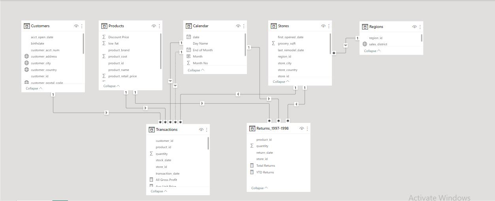
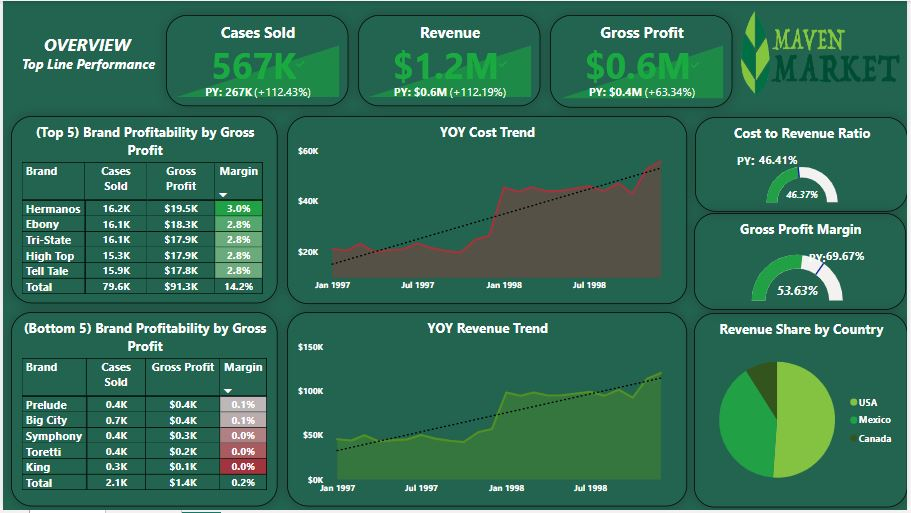

# Maven Market Top Line Performance Analysis

## Introduction
Using Power BI, I performed a high-level examination of a **Maven Market** dataset and employed various techniques such as DAX measures and data modeling to gain insights. Additionally, I delivered valuable business insights and visualizations to present the findings.  Specifically, I utilized DAX measures like calculated columns, related functions, iterator functions (such as SUMX), and time intelligence formulas to explore the dataset. Furthermore, I implemented data modeling techniques like snowflake schemas, one-to-many relationship cardinality, and one-way filter flows. 

The analysis was framed by a set of questions that aimed to solve business problems, such as identifying revenue trends between 1997 and 1998, improving the presence of countries with low business presence, pinpointing the most profitable brand and suggesting which brands should be discontinued, analyzing the impact of costs on gross profit and recommending measures to control them. The ultimate goal of this analysis was to provide insights that can be acted upon to enhance business performance and promote growth.

## Data Sourcing
For this project, I utilized a dataset from an Udemy course project called **Maven Market** and used Power BI to shape and connect the data. A total of 7 tables were used:
- CALENDER: 730 rows, 7 columns
- CUSTOMERS: 10,281 rows, 19 columns
- PRODUCTS: 1,560 rows, 10 columns
- REGION: 109 rows, 3 columns
- RETURNS: 7,087 rows, 4 columns
- STORES: 24 rows, 13 columns
- TRANSACTIONS: 269,720 rows, 6 columns

## Data Transformation and Cleaning
To guarantee the precision and uniformity of the data, I leveraged Power Query Editor in Power BI to perform data transformation and cleansing tasks. The following are some of the measures I took:
- Named all tables and confirmed that headers were appropriately promoted.
- Checked and corrected all data types.
- Incorporated calculated columns into tables where appropriate.
- Implemented Time Intelligence Formulas, such as Performance To-Date and Previous Period formulas, to facilitate common time comparisons.
- Deployed different DAX measures, including Related, Calculate, and Iterate function (Sumx).

## Data Modelling
To establish meaningful connections between the tables in the dataset, I conducted a thorough analysis of the primary and foreign keys in each table. Although Power BI generated some relationships automatically, I detected some missing relationships. To address this, I established a relationship between the primary key "DATE" in the "Calendar" table and the corresponding key "DATE" in the "Transactions" table.

Throughout this process, I verified the relationship between the "Region" table and the "Transactions" table. However, I noticed that there was no primary key to link the "Region" and "Transactions" tables. To remedy this issue, I employed a "Snowflake Schema" to link the "Region" and "Stores" tables. Additionally, I ensured that all relationships followed a "One to Many Cardinality" and that all filters were "One-Way," which meant that there were no "Two-Way Filters."

## Dashboard

_For dashboard interaction click [here](https://app.powerbi.com/links/JtuoVZDEck?ctid=f2c35211-7dad-42d6-b895-25d82fc1f0a2&pbi_source=linkShare)_

## Analysis
**After analyzing the data using Power BI, the following insights were obtained:**
- The revenue experienced a substantial increase of 112% between 1997 and 1998, primarily due to the strategic expansion of the business into Mexico and Canada.
- However, the sales volume in Canada was low, accounting for only 8.98% of the total business, while the US generated the highest revenue with 51.9% and Mexico with 39.94%.
- The increase in revenue also had a positive impact on gross profit. However, growing costs, as seen in the "YOY Cost Trend," led to a decrease in gross margin from 69.67% in 1997 to 53.63% in 1998.
- In terms of brand profitability, all brands contributed to the total gross profit. The highest profitability was driven by "Hermanos" at 3.02%, followed by "Ebony" at 2.85%, and "Tri State" and "High Top" at 2.78% each.
- On the other hand, the bottom three performing brands were "King" at 0.02%, "Toretti" at 0.03%, and "Symphony" at 0.04%. Hence, It is recommended that strategic decisions should be made on the discontinuation of these brands.

## Conclusion
Based on the analysis, it can be concluded that the expansion into Mexico and Canada was a major contributing factor to the 112% growth in revenue. However, the low sales volume in Canada indicates a need to improve business presence in that country. Cost accounted for almost half of the revenue in both 1997 and 1998, but gross profit margin declined significantly from 69.67% in 1997 to 53.63% in 1998 due to the rising cost trend. The brand "Hermanos" showed the highest profitability, while the brands "King", "Toretti", and "Symphony" were the least profitable and may need to be discontinued. The highest performing country was the USA with 479K cases, while Canada was the least performing country. These insights can inform strategic decisions for improving business performance and profitability.

## Recommendation
**Based on the insights gained from the analysis, the following recommendations are suggested:**
- Country-specific promotional activities can be implemented in Canada to boost sales volume, as it currently accounts for a small percentage of total business.
- Cost control measures should be adopted to optimize purchasing and reduce costs as growing costs resulted in a decline in gross profit margin in 1998.
- Strategic decisions such as changing marketing strategies can be implemented to improve the profitability of the bottom-performing brands. This is crucial as the top-performing brand accounted for a significantly higher percentage of total gross profit compared to the bottom-performing brands. Discontinuing underperforming brands can also be considered a strategic decision.
- Conduct further analysis to identify the reasons behind the low sales volume in Canada and develop a targeted action plan to improve business presence in the country. This could include market research to understand the needs and preferences of Canadian customers, as well as collaboration with local distributors and retailers.
- Explore ways to optimize pricing strategies in order to improve gross profit margins. This could include conducting market research to understand price sensitivity and elasticity of demand, as well as developing dynamic pricing models that take into account factors such as seasonality, product lifecycle, and competitor pricing.
- Establish a regular reporting and monitoring system to track key performance metrics such as revenue, costs, gross profit margins, and brand profitability. This will help identify areas of improvement and ensure that the business stays on track towards its goals.

